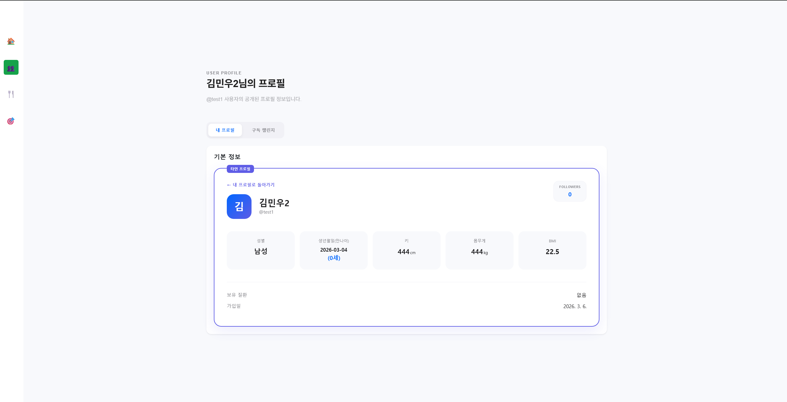

# 👤 사용자 관리 및 프로필 시스템 (User Management)

얌얌(Yamyam) 프로젝트의 핵심 사용자 기능인 회원 가입, 프로필 관리, 그리고 소셜(팔로워) 기능을 담당합니다. 모든 데이터는 브라우저의 `localStorage`를 통해 유지되어 별도의 서버 없이도 영속성을 보장합니다.

## 🖼️ 주요 화면 미리보기

| 회원가입 | 로그인 | 정보화면 |
|:---:|:---:|:---:|
|  |  |  |

| 정보수정 | 팔로워추가 | 남의 정보 조회 |
|:---:|:---:|:---:|
|  |  |  |
---

## ✨ 핵심 구현 기능

### 1. 사용자 인증 및 가입
- **로그인/회원가입**: Bootstrap 5.2를 활용한 반응형 폼 디자인.
- **실시간 데이터 저장**: 가입된 유저 정보는 `yamyam_users` 키로 로컬 스토리지에 JSON 형식으로 저장됩니다.

### 2. 고도화된 프로필 관리
- **나이 자동 계산**: 사용자가 입력한 생년월일을 바탕으로 **만 나이**를 실시간으로 계산하여 표시합니다.
- **건강 지표(BMI)**: 입력된 키와 몸무게를 기반으로 BMI를 자동 산출합니다.
- **프로필 사진 변경**: 
  - 카메라 아이콘을 통해 이미지 업로드 가능.
  - 별도의 서버 없이 **Base64** 데이터로 변환하여 유저 데이터에 포함 저장.
  - 정보 수정 시에도 사진 데이터가 소실되지 않도록 예외 처리 완료.

### 3. 소셜 팔로워 시스템
- **팔로워 관리**: 
  - 사용자 아이디 기반으로 팔로워를 검색하여 추가.
  - 존재하지 않는 아이디 또는 본인 아이디 추가 시 경고 메시지 출력.
  - 모달(Modal) 창을 통한 팔로워 목록 조회 및 실시간 삭제(팔로우 취소).
- **실시간 UI 갱신**: 추가/삭제 시 마이페이지 상단의 팔로워 숫자가 즉각적으로 갱신되도록 구현.

### 4. 타인 프로필 조회 모드
- **시각적 구분**: 타인의 프로필을 조회할 때 카드 테두리에 **보라색(Indigo)** 강조색을 적용하여 본인 계정과 명확히 구분.
- **배지 및 버튼**: '타인 프로필' 배지 노출 및 '내 프로필로 돌아가기' 버튼 제공.
- **보안/권한 제어**: 타인 정보를 볼 때는 '정보 수정', '로그아웃', '계정 탈퇴' 등 민감한 관리 버튼이 자동으로 숨겨집니다.

### 5. 개발자용 API 지원
외부 모듈(챌린지, 식단 관리 등)과의 연동을 위해 다음 API를 전역 객체(`window`)에 공개합니다.
- `apiAddDietData(userId, entry)`: 특정 유저에게 식단 데이터 추가.
- `apiGetSortedDiets(userId)`: 날짜순 정렬된 식단 목록 반환.
- `apiSubscribeChallenge(userId, data)`: 특정 유저에게 새로운 챌린지 구독 정보 추가.

---

## 🛠️ 기술 스택
- **HTML5 / CSS3 (Vanilla CSS)**: 현대적인 카드 레이아웃 및 애니메이션.
- **JavaScript (ES6+)**: 데이터 파싱, 로컬 스토리지 관리, 실시간 UI 업데이트.
- **Bootstrap 5.2**: 모달 및 버튼 컴포넌트 라이브러리.

# 식단 관리 기능

## 1. 기능 개요

식단 관리 기능은 사용자가 하루 동안 섭취한 음식을 기록하고,
각 식단의 칼로리와 총 섭취 칼로리를 확인할 수 있도록 하는 기능입니다.

사용자는 DB에 저장된 음식을 검색하여 식단에 추가할 수 있으며,
식단 기록을 통해 자신의 하루 식습관을 관리할 수 있습니다.

---

## 2. 주요 기능

### 2.1 식단 추가, 수정, 삭제

* 사용자는 새로운 식단을 작성할 수 있습니다.
* 아침, 점심, 저녁, 간식으로 목록을 지정합니다. 
* 음식 검색 기능을 통해 DB에 등록된 음식을 선택할 수 있습니다.
* 여러 개의 음식을 하나의 식단에 추가할 수 있습니다.

### 2.2 하루 식단 조회

* 작성된 식단 목록을 사이드바 형태로 확인할 수 있습니다. 오늘 먹은 식사의 총 칼로리, 음식 목록을 확인할 수 있습니다.

### 2.3 개별 식단 상세 조회

* 개별 식단 목록을 클릭하면 각 음식의 칼로리, 영양정보, 식단의 총 칼로리 등의 정보를 확인할 수 있습니다.

---

### 2.4 총 섭취 칼로리 계산

* 하루 동안 기록된 모든 식단의 칼로리를 합산하여 표시합니다.

# 🎯헬스 챌린지 및 스마트 식단 시스템 (Challenge & Diet)

사용자가 자신만의 건강 목표를 설계하고, 실제 식품 영양 DB를 기반으로 식단을 시뮬레이션하며 성장을 기록할 수 있습니다. 다른 사람의 챌린지를 구독하여 자신의 식단을 개선해 보세요!

## 주요 화면
### 챌린지 목록

> 사용자들이 작성한 식단 혹은 챌린지를 구독할 수 있습니다

### 내 챌린지

> 나만의 챌린지와 미션들을 확인할 수 있습니다.

### 챌린지 만들기

> 나만의 챌린지를 직접 만들 수 있습니다.

> 챌린지 이름, 난이도, 기간, 목표 칼로리를 설정한 후, 음식 DB에서 칼로리와 영양성분을 가져와 식단을 구성합니다.

> 식단 생성이 완료되었습니다!

> 추가한 챌린지는 챌린지 목록에 추가되며, 다른 사람에게 공유하거나, 다른 사람의 챌린지를 구독할 수 있습니다.

## Challenge 파트 핵심 구현 기능

### 1. 난이도별 로드맵 기반 탐색 (Explore)
- 프리미엄 리스트 UI: 초급(🌱), 중급(🔥), 상급(🏆)으로 분류된 챌린지를 수직 로드맵 형태로 제공하여 사용자 수준에 맞는 목표를 제안합니다.

- 인터랙티브 리스트 카드: 호버 시 위로 떠오르는(Floating) 애니메이션과 입체적인 그림자 효과를 적용하여 클릭 효율을 높였습니다.

### 2. 지능형 챌린지 빌더 (Smart Builder)
- 실시간 영양 시뮬레이션: 식단 입력 시 우측 사이드바의 Live Preview 시스템이 총 칼로리, 일일 평균, 목표 달성률을 즉각적으로 계산합니다.

- 식품 DB 자동완성: 10,000개 이상의 공공데이터 기반 식품 DB를 CSV 파싱 기술로 연동하여 메뉴 입력 시 칼로리 정보를 자동으로 불러옵니다.

- 정밀한 데이터 핸들링: 정규표현식을 활용한 cleanNum 헬퍼 함수를 통해 식품 중량과 기준량에 따른 정확한 영양 성분비를 산출합니다.

### 3. 감성적인 '내 챌린지' 대시보드
- 글래스모피즘(Glassmorphism) 디자인: 투명하고 부드러운 유리 질감의 카드 섹션을 통해 세련된 대시보드 레이아웃을 구현했습니다.

- 실시간 진행도 추적: startDate 기반 로직을 통해 현재 챌린지의 몇 일차인지 자동 계산하며, 전체 여정의 진행률을 시각화합니다.

- 캐릭터 성장 연동: 사용자의 활동 데이터를 기반으로 캐릭터의 레벨과 경험치 바가 실시간으로 갱신됩니다.

### 4. 인터랙티브 세컨더리 사이드바 (Live Sidebar)
- 7일 미니 캘린더: 주간 단위의 성취 여부를 시각화하여 사용자가 본인의 꾸준함을 한눈에 확인할 수 있도록 지원합니다.

- 데일리 리추얼 체크: 필수 미션을 체크할 때마다 상단 캘린더에 **성공 점(Dot)**이 실시간으로 찍히는 인터랙션.

- 성공 도장 시스템 (Stamp UX): 하루의 일과를 마무리하며 찍는 아날로그 감성의 도장 버튼을 통해 최종 성공 여부를 확정 짓고 성취감을 극대화합니다.
