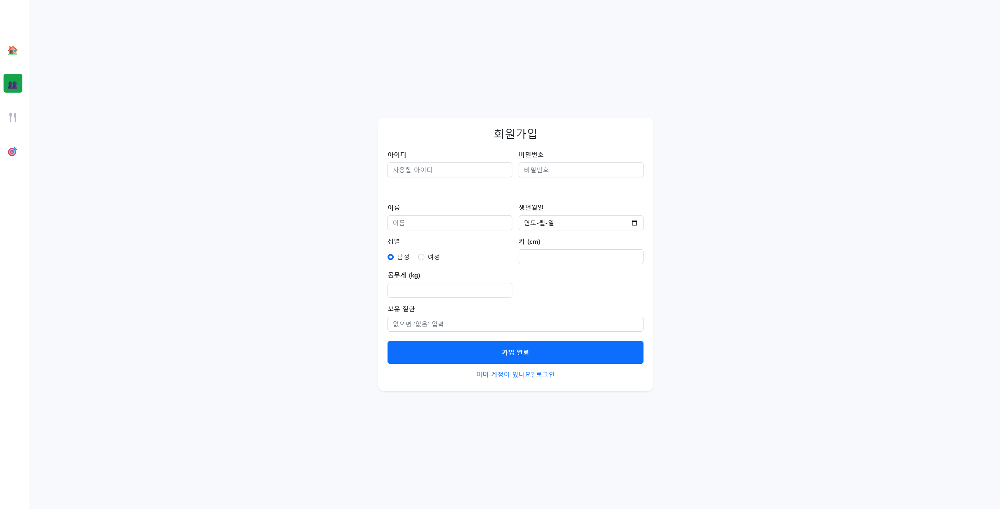
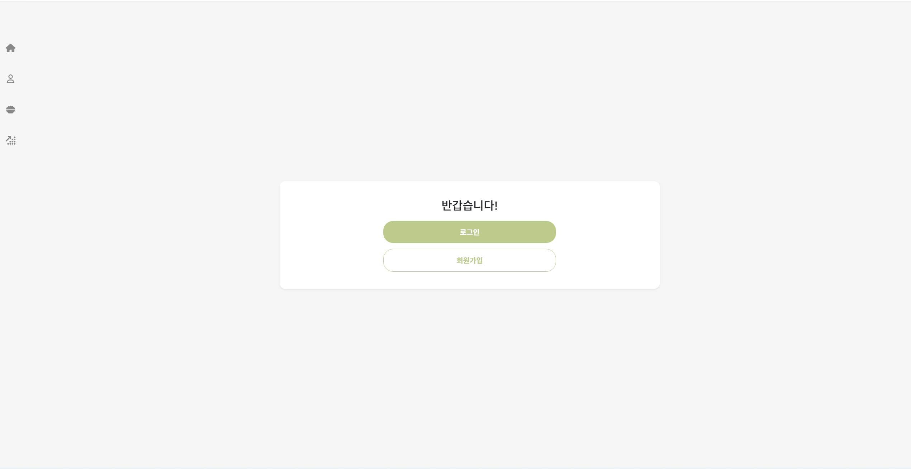
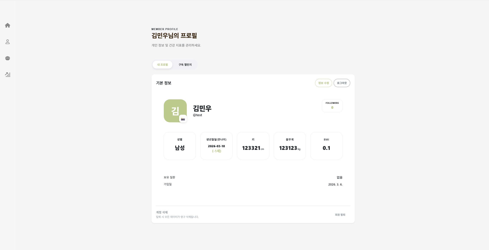
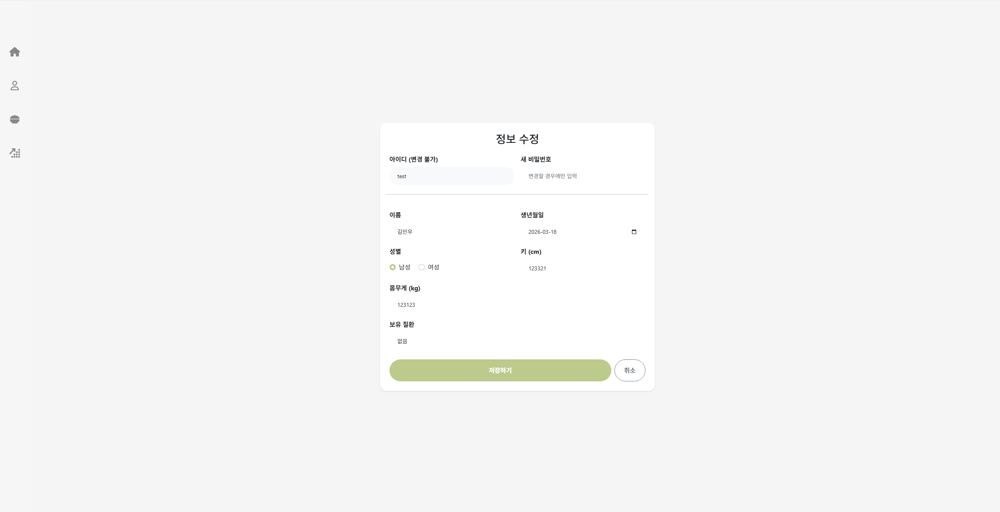
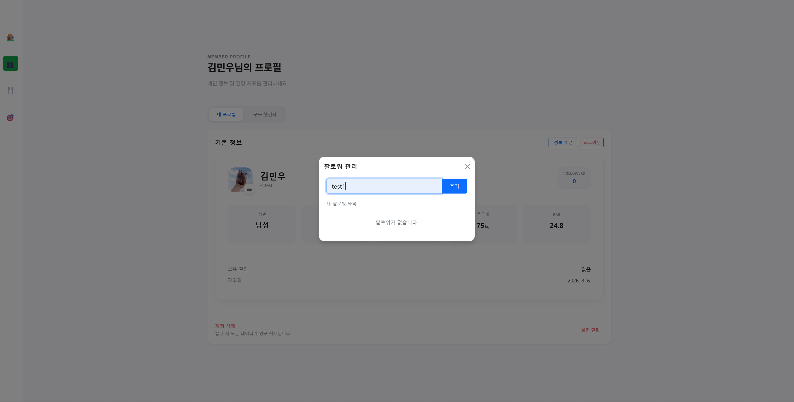
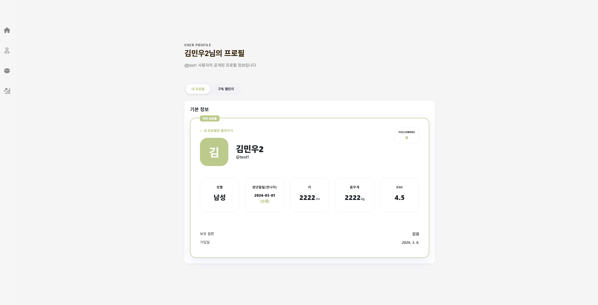

# YUM YUM (당신의 식단을 관리해드릴게요)

## 기술 스택
- HTML5 / CSS3 (Vanilla CSS) / 
- JavaScript (ES6+)
- Bootstrap

## 기능 1. 회원 관리 및 프로필

회원 가입, 로그인, 프로필 관리, 팔로워 관리를 진행합니다. 모든 데이터는 브라우저의 localStorage를 통해 저장됩니다.

### 주요 기능

#### 1. 로그인, 회원 가입
- 로그인 및 회원가입을 진행합니다. 프로필 관리, 팔로워 관리가 가능합니다.

| 회원가입 | 로그인 | 정보화면 |
|:---:|:---:|:---:|
|  |  |  |

#### 2. 프로필 관리
- 프로필 사진 업로드  
- 입력된 키와 몸무게를 기준으로 BMI 계산  

#### 3. 팔로워
- 사용자 ID 검색을 통해 팔로워 추가
- 팔로워 목록 조회 및 삭제

| 정보수정 | 팔로워추가 | 타인 정보 조회 |
|:---:|:---:|:---:|
|  |  |  |

## 기능 2. 식단 관리

사용자가 하루 동안 섭취한 음식을 기록하고, 각 식단의 칼로리와 총 섭취 칼로리를 확인할 수 있습니다.

### 주요 기능

#### 1. 식단 추가, 수정, 삭제
- 새로운 식단 기록 생성
- 음식 검색을 통해 DB에 등록된 음식 선택
- 하나의 식단에 여러 음식 추가 가능

#### 2. 하루 식단 조회
- 오늘 섭취한 총 칼로리와 음식 목록
- 식단 목록 클릭 시 상세 정보 조회 가능

  - 음식별 칼로리
  - 영양 정보
  - 식단 총 칼로리

## 기능 3. 챌린지

사용자가 건강 목표를 설정하고 식단을 구성하며 기록할 수 있습니다. 다른 사용자의 챌린지를 구독하여 목표를 공유할 수 있습니다.

### 주요 기능

#### 1. 난이도 기반 챌린지 탐색
- 초급, 중급, 상급 난이도별 챌린지 분류
- 마우스 호버 시 카드 애니메이션 적용

#### 2. 챌린지 생성

사용자가 직접 챌린지를 생성할 수 있습니다.

챌린지 이름, 난이도, 기간, 목표 칼로리를 설정하고  
식품 DB를 이용하여 식단을 구성합니다.

챌린지 생성이 완료된 화면입니다.

생성된 챌린지는 목록에 추가되며 다른 사용자가 구독할 수 있습니다.

#### 3. 챌린지 대시보드
챌린지 목록

사용자가 생성한 챌린지를 확인하고 구독할 수 있습니다.

내 챌린지

현재 진행 중인 챌린지와 목표를 확인할 수 있습니다.
