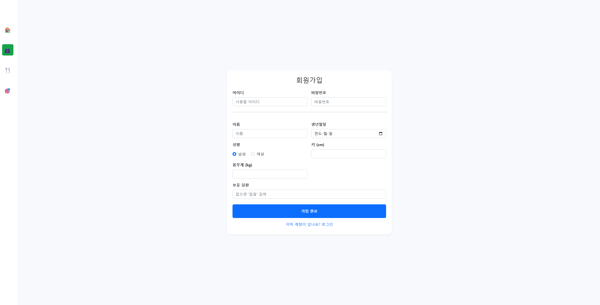
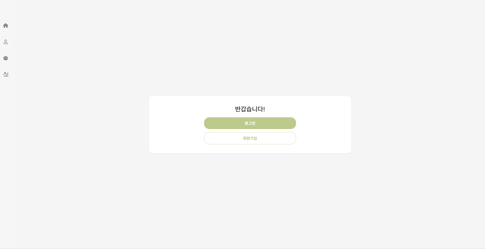
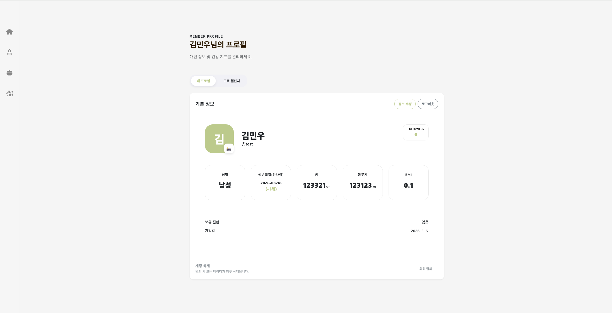
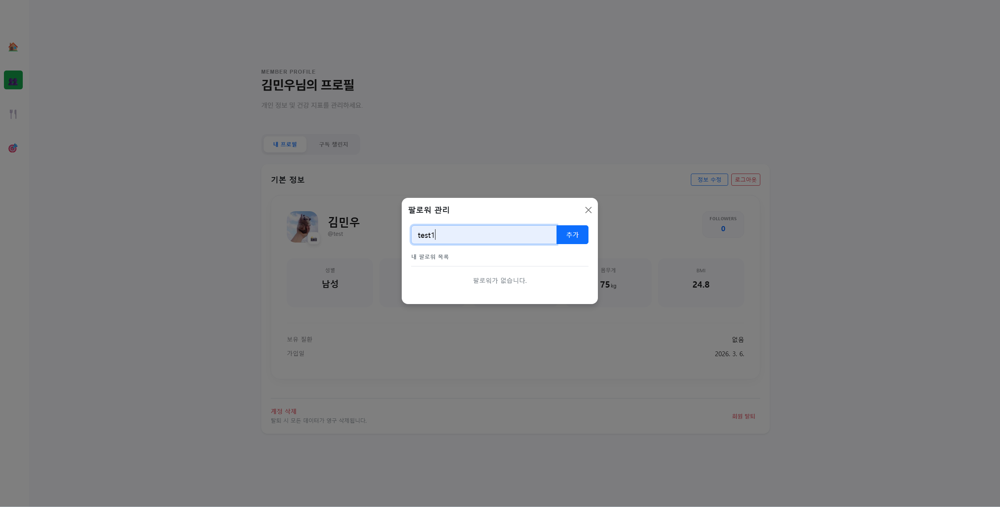
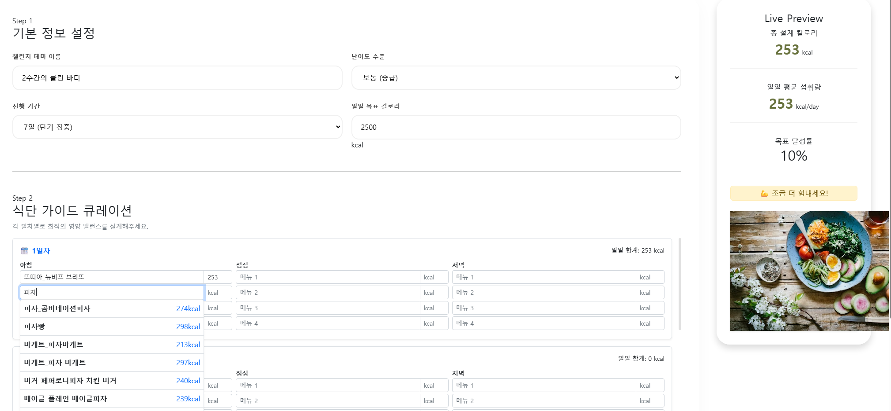

# YUM YUM (당신의 식단을 관리해드릴게요)


## 기술 스택
- HTML5 / CSS3 (Vanilla CSS) / 
- JavaScript (ES6+)
- Bootstrap


## 기능 1. 회원 관리 및 프로필

회원 가입, 로그인, 프로필 관리, 팔로워 관리를 진행합니다. 모든 데이터는 브라우저의 localStorage를 통해 저장됩니다.

### 주요 기능

#### 1. 로그인, 회원 가입
- 로그인 및 회원가입을 진행합니다. 프로필 관리, 팔로워 관리가 가능합니다.

| 회원가입 | 로그인 | 정보화면 |
|:---:|:---:|:---:|
|  |  |  |

#### 2. 프로필 관리
- 프로필 사진 업로드  
- 입력된 키와 몸무게를 기준으로 BMI 계산  

#### 3. 팔로워
- 사용자 ID 검색을 통해 팔로워 추가
- 팔로워 목록 조회 및 삭제

| 정보수정 | 팔로워추가 | 타인 정보 조회 |
|:---:|:---:|:---:|
|  |  |  |


## 기능 2. 식단 관리

사용자가 하루 동안 섭취한 음식을 기록하고, 각 식단의 칼로리와 총 섭취 칼로리를 확인할 수 있습니다.

### 주요 기능

#### 1. 식단 추가, 수정, 삭제
- 새로운 식단 기록 생성
- 음식 검색을 통해 DB에 등록된 음식 선택
- 하나의 식단에 여러 음식 추가 가능


#### 2. 하루 식단 조회
- 오늘 섭취한 총 칼로리와 음식 목록
- 식단 목록 클릭 시 상세 정보 조회 가능

  - 음식별 칼로리
  - 영양 정보
  - 식단 총 칼로리


## 기능 3. 챌린지

사용자가 건강 목표를 설정하고 식단을 구성하며 기록할 수 있습니다. 다른 사용자의 챌린지를 구독하여 목표를 공유할 수 있습니다.

### 주요 기능

#### 1. 난이도 기반 챌린지 탐색
- 초급, 중급, 상급 난이도별 챌린지 분류
- 마우스 호버 시 카드 애니메이션 적용

#### 2. 챌린지 생성


사용자가 직접 챌린지를 생성할 수 있습니다.



챌린지 이름, 난이도, 기간, 목표 칼로리를 설정하고  
식품 DB를 이용하여 식단을 구성합니다.


챌린지 생성이 완료된 화면입니다.


생성된 챌린지는 목록에 추가되며 다른 사용자가 구독할 수 있습니다.

#### 3. 챌린지 대시보드
챌린지 목록


사용자가 생성한 챌린지를 확인하고 구독할 수 있습니다.

내 챌린지


현재 진행 중인 챌린지와 목표를 확인할 수 있습니다.

# 📝 알고리즘 적용 기획서 #Hash

## ◼ 내용 : bcrypt를 이용한 사용자 인증 및 보안 서비스
제공된 `user_server.js`를 기반으로, 사용자 비밀번호를 평문으로 저장하지 않고 **단방향 암호화(Hashing)**하여 보안성을 극대화한 인증 시스템입니다.

## ◼ 적용 알고리즘 : bcrypt (Password Hashing Function)

## ◼ 알고리즘 개요
**bcrypt**는 패스워드 저장을 위해 설계된 강력한 해시 함수로, 단순 해시 함수와 차별화되는 보안 메커니즘을 제공합니다.

* **Salting (솔팅):** `bcrypt.genSalt(10)`을 통해 생성된 고유한 Salt 값을 비밀번호와 결합합니다. 이를 통해 레인보우 테이블 공격(미리 계산된 해시 표)을 효과적으로 방어합니다.
* **Key Stretching (키 스트레칭):** 해싱 연산을 반복하여 Brute-force 공격에 필요한 연산 시간을 의도적으로 지연시킵니다.
* **Adaptive Cost:** 성능에 따라 해싱 강도를 조절할 수 있습니다. 본 코드에서는 `cost factor 10`을 적용했습니다.

## ◼ 적용 서비스 : Yamyam (얌얌) 건강 관리 플랫폼
- **서비스 명:** 보안 강화형 사용자 인증 시스템 (Secure User Authentication System)

---

## ◼ 적용 서비스 개발 개요

### 1. 기술적 구현 배경
본 서비스는 사용자의 신체 정보(키, 몸무게, 질환 등)를 다루는 **Yamyam** 플랫폼의 특성상, 계정 보안을 최우선으로 설계되었습니다. 데이터베이스(Memory DB)가 노출되더라도 사용자의 실제 비밀번호는 복구할 수 없도록 **bcryptjs** 라이브러리를 활용하여 단방향 암호화를 구현했습니다.

### 2. 핵심 구현 로직 (Source Code Logic)

#### A. 회원가입 시 비밀번호 해싱 (Registration)
사용자가 입력한 평문 비밀번호를 서버에서 수신한 즉시 암호화 프로세스를 시작합니다.
1.  `bcrypt.genSalt(10)`를 사용하여 10단계의 강도를 가진 고유 Salt를 생성합니다.
2.  `bcrypt.hash(data.pw, salt)`를 통해 Salt와 평문을 결합한 최종 해시값을 생성합니다.
3.  생성된 `hashedPassword`를 메모리 DB(`userDb`)에 저장합니다.

#### B. 로그인 시 비밀번호 검증 (Authentication)
비밀번호는 단방향으로 암호화되어 복호화가 불가능하므로, `compare` 함수를 사용합니다.
1.  로그인 시도 시 입력된 평문 비밀번호와 DB에 저장된 해시값을 불러옵니다.
2.  `bcrypt.compare(data.pw, user.pw)`를 호출하여 입력값과 기존 해시값의 일치 여부를 연산합니다.
3.  일치할 경우에만 `yamyam_session`을 발급하여 인증을 완료합니다.

#### C. 정보 수정 시 암호화 업데이트 (Update)
사용자가 프로필 수정 시 비밀번호를 변경하는 경우(`if (data.pw)`), 새로운 Salt를 생성하고 해싱을 다시 수행하여 DB를 갱신하도록 설계하여 연속적인 보안성을 유지합니다.

### 3. 주요 코드 스니펫 (Node.js)

```javascript
// user_server.js 내 구현부
const salt = await bcrypt.genSalt(10); // Salt 생성
const hashedPassword = await bcrypt.hash(data.pw, salt); // 해싱 저장

// 검증부
const isMatch = await bcrypt.compare(data.pw, user.pw); // 평문 vs 해시 비교

```
### 내부 Map 에 해쉬된 상태로 저장된 모습


