# YUM YUM (당신의 식단을 관리해드릴게요)


## 기술 스택

- HTML5 / CSS3 (Vanilla CSS) /
- JavaScript (ES6+)
- Bootstrap

## 기능 1. 회원 관리 및 프로필

회원 가입, 로그인, 프로필 관리, 팔로워 관리를 진행합니다. 모든 데이터는 브라우저의 localStorage를 통해 저장됩니다.

### 주요 기능

#### 1. 로그인, 회원 가입

- 로그인 및 회원가입을 진행합니다. 프로필 관리, 팔로워 관리가 가능합니다.

|                  회원가입                   |                 로그인                  |                  정보화면                   |
| :-----------------------------------------: | :-------------------------------------: | :-----------------------------------------: |
| 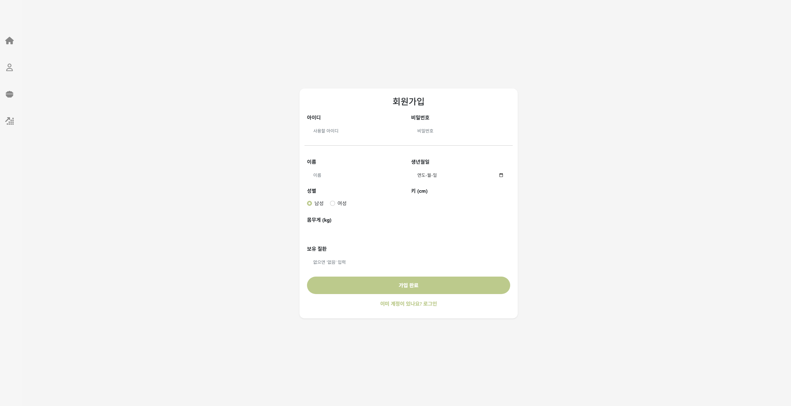 |  |  |

#### 2. 프로필 관리

- 프로필 사진 업로드
- 입력된 키와 몸무게를 기준으로 BMI 계산

#### 3. 팔로워

- 사용자 ID 검색을 통해 팔로워 추가
- 팔로워 목록 조회 및 삭제

|                  정보수정                   |                   팔로워추가                    |                타인 정보 조회                |
| :-----------------------------------------: | :---------------------------------------------: | :------------------------------------------: |
| 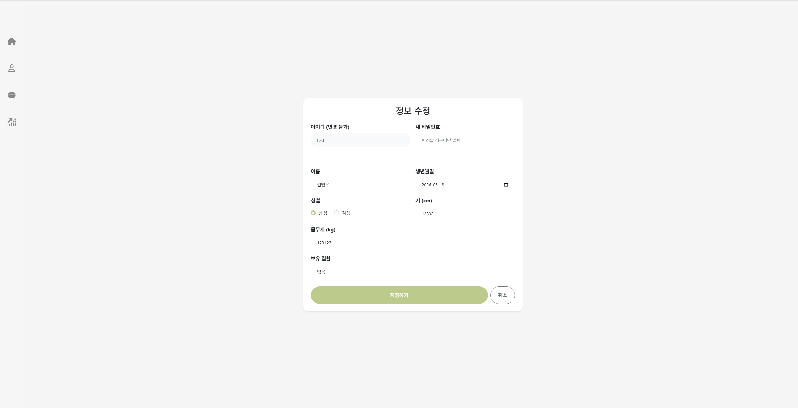 | 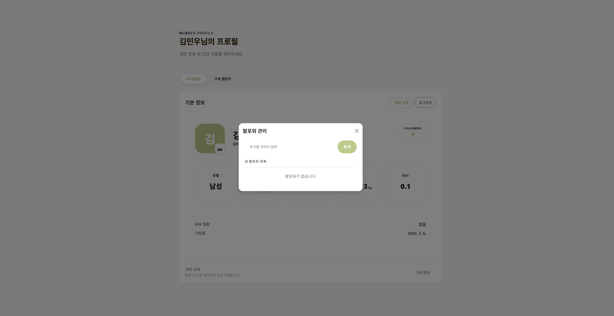 | 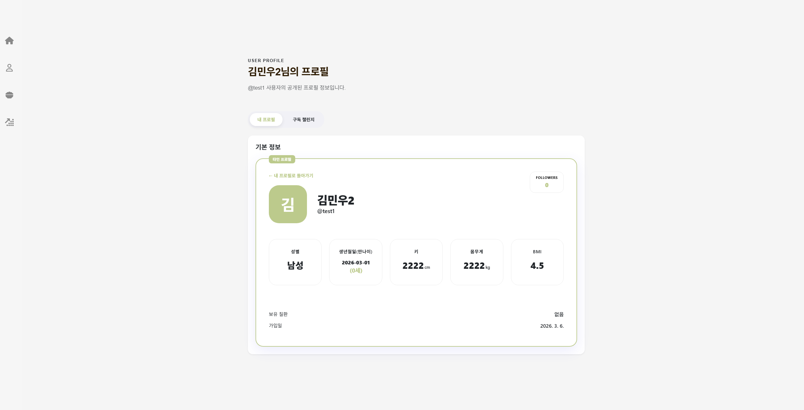 |

## 기능 2. 식단 관리

사용자가 하루 동안 섭취한 음식을 기록하고, 각 식단의 칼로리와 총 섭취 칼로리를 확인할 수 있습니다.

### 주요 기능

#### 1. 식단 추가, 수정, 삭제

- 새로운 식단 기록 생성
- 음식 검색을 통해 DB에 등록된 음식 선택
- 하나의 식단에 여러 음식 추가 가능

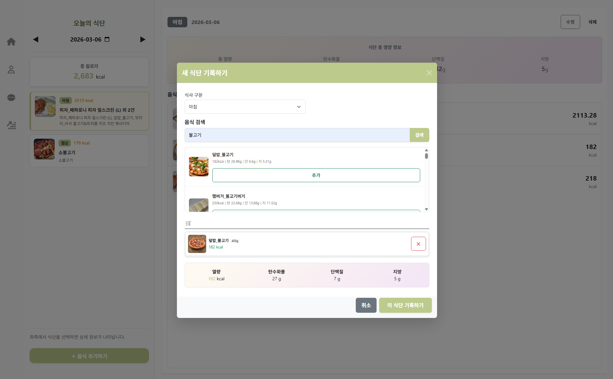
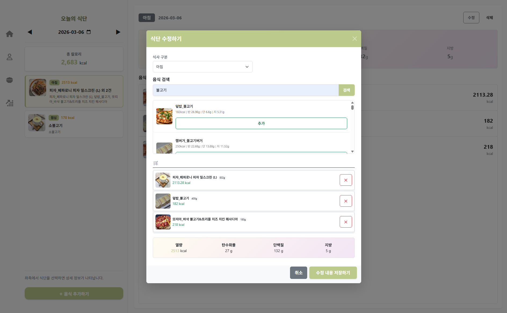

#### 2. 하루 식단 조회

- 오늘 섭취한 총 칼로리와 음식 목록
- 식단 목록 클릭 시 상세 정보 조회 가능
  - 음식별 칼로리
  - 영양 정보
  - 식단 총 칼로리

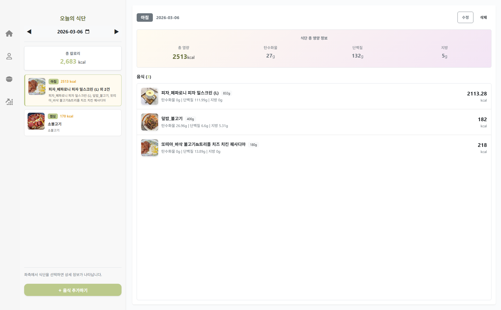

## 기능 3. 챌린지

사용자가 건강 목표를 설정하고 식단을 구성하며 기록할 수 있습니다. 다른 사용자의 챌린지를 구독하여 목표를 공유할 수 있습니다.

### 주요 기능

#### 1. 난이도 기반 챌린지 탐색

- 초급, 중급, 상급 난이도별 챌린지 분류
- 마우스 호버 시 카드 애니메이션 적용

#### 2. 챌린지 생성


사용자가 직접 챌린지를 생성할 수 있습니다.


챌린지 이름, 난이도, 기간, 목표 칼로리를 설정하고  
식품 DB를 이용하여 식단을 구성합니다.


챌린지 생성이 완료된 화면입니다.


생성된 챌린지는 목록에 추가되며 다른 사용자가 구독할 수 있습니다.

#### 3. 챌린지 대시보드

챌린지 목록


사용자가 생성한 챌린지를 확인하고 구독할 수 있습니다.

내 챌린지


현재 진행 중인 챌린지와 목표를 확인할 수 있습니다.

## 기능 4. AI 챗봇

YamYam의 AI 챗봇은 사용자의 식단, 건강, 음식 관련 질문에 대해 자연스럽고 빠른 답변을 제공하는 기능입니다. GPT 기반 응답 생성과 RAG(Retrieval-Augmented Generation) 구조를 함께 활용해, 일반적인 대화뿐 아니라 서비스 내 건강·영양 정보에 기반한 답변도 제공할 수 있도록 구현했습니다.

https://github.com/user-attachments/assets/51341bfb-33fa-47bb-988f-2159f12e4d98

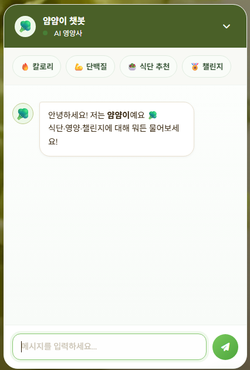

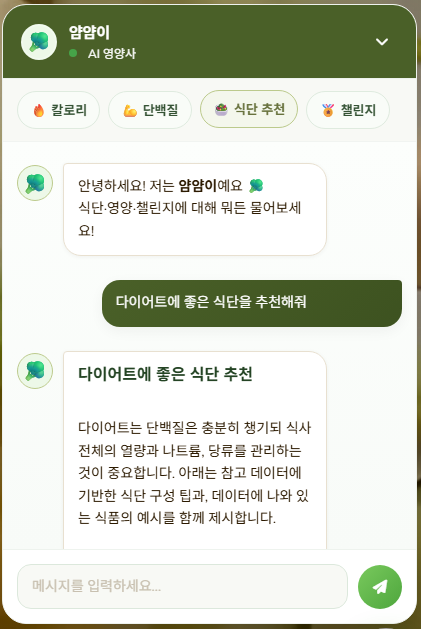

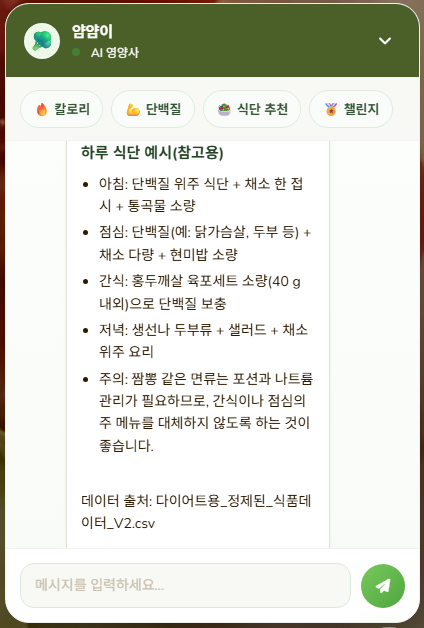

### 주요 기능

#### 1. Chat-GPT API 기반 응답 생성

- GPT 모델을 활용해 사용자의 질문에 대한 자연스러운 답변을 생성합니다.
- 음식, 식단, 건강 관리와 관련된 다양한 질문에 대화형으로 응답할 수 있습니다.
- 사용자가 이해하기 쉬운 형태로 답변을 제공해 서비스 이용 편의성을 높였습니다.

#### 2. RAG 기반 맞춤형 정보 제공

- 미리 구축한 건강·영양 관련 지식 데이터를 검색한 뒤, 이를 바탕으로 더 정확한 답변을 생성합니다.
- 예를 들어, 특정 음식의 효능, 식단 관리 팁, 건강 상태별 추천 음식과 같은 질문에 서비스와 관련된 식단 구성 방법과 같은 답변을 제공합니다.

- 임베딩 모델: `paraphrase-multilingual-MiniLM-L12-v2` (한국어 지원)
- 유사도 임계값(`0.45`) 이상인 문서만 컨텍스트로 활용
- 세션 ID 기반 대화 히스토리 유지 (최근 4턴)
- GPT 모델: `gpt-5-nano`
-

### 데이터 수집, 정제

#### 1. DatatSource : 공공데이터 포털

- [전국통합식품영양성분정보표준데이터] https://www.data.go.kr/data/15100064/standard.do
- [전국통합식품영양성분정보(가공식품)표준데이터]https://www.data.go.kr/data/15100066/standard.do
- [전국통합식품영양성분정보(원재료성식품)표준데이터] https://www.data.go.kr/data/15100065/standard.do
- [전국통합식품영양성분정보(음식)표준데이터] https://www.data.go.kr/data/15100070/standard.do

#### 2. 데이터 정제 기준

- 데이터에서 식단 관리에 관계없는 품목 코드 등 데이터 제거
- 결측치가 너무 많은 데이터거나 식단 관리에 큰 관련 없는 데이터 제거
- 중복되는 식품행 제거
  

#### 3. CSV 데이터 → Vector DB 적재

대용량 CSV 파일(약 6만 건)을 row 단위로 읽어 각 행을 텍스트로 변환한 뒤, 임베딩하여 ChromaDB에 저장하는 파이프라인을 구성하였다.

- 각 row를 `컬럼명: 값` 형태의 문자열로 변환
- 빈 값(`NaN`)은 자동으로 제외하여 노이즈 최소화
- 파일명(`.stem`)을 카테고리로 활용하여 `[카테고리] 내용` 형태로 저장
- 한글 인코딩 자동 감지 (`utf-8` → `cp949` → `euc-kr` 순차 시도)

```python
content = ", ".join([f"{col}: {val}" for col, val in row.items() if pd.notna(val)])
row_texts.append(f"[{category}] {content}")
```

##### 대용량 처리를 위한 배치 임베딩

메모리 과부하 방지를 위해 500건 단위로 나누어 임베딩 및 저장 처리.

```python
batch_size = 500
for i in range(0, total_rows, batch_size):
    batch_df = df.iloc[i : i + batch_size]
    # 임베딩 후 ChromaDB에 적재
```

#### 4. Vector DB 영속성 확보 (서버 재시작 시 데이터 유지)

서버가 재시작될 때마다 6만 건을 재임베딩하는 문제를 해결하기 위해, ChromaDB의 `PersistentClient`를 활용하여 데이터를 디스크에 영구 저장하였다.

- 서버 시작 시 기존 데이터 존재 여부를 확인
- 데이터가 있으면 재적재 없이 기존 DB를 그대로 사용
- 데이터가 없을 때만 CSV 파일을 읽어 최초 적재 수행

```python
chroma_client = chromadb.PersistentClient(path="./chroma_data")
collection = chroma_client.get_or_create_collection(name="health_care_db")

current_count = collection.count()
if current_count > 0:
    print(f"기존 {current_count}개 데이터 사용")  # 재적재 생략
else:
    process_csv_to_db(f)  # 최초 1회만 실행
```

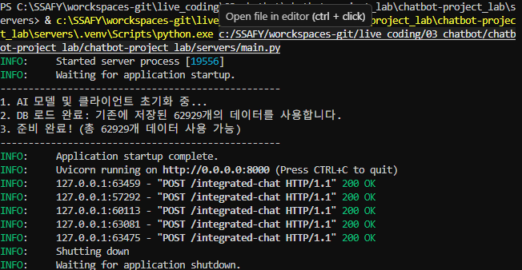

##### 최종 아키텍처

```
사용자 질문
    ↓
[임베딩] paraphrase-multilingual-MiniLM-L12-v2
    ↓
[유사도 검색] ChromaDB (코사인 유사도)
    ↓
[컨텍스트 구성] 유사도 0.45 이상 문서 필터링
    ↓
[GPT 호출] gpt-5-nano + RAG 컨텍스트
    ↓
사용자 응답 (마크다운 형식)
```
