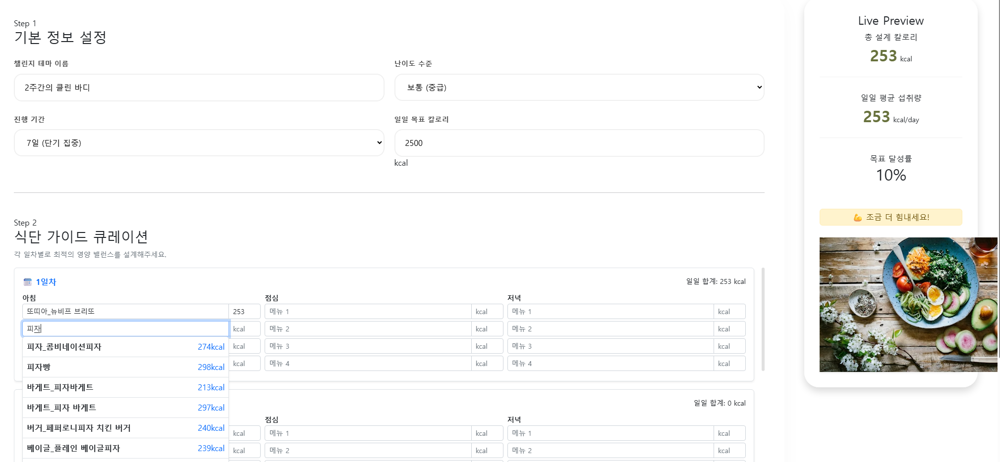

# 🎯헬스 챌린지 및 스마트 식단 시스템 (Challenge & Diet)

사용자가 자신만의 건강 목표를 설계하고, 실제 식품 영양 DB를 기반으로 식단을 시뮬레이션하며 성장을 기록할 수 있습니다. 다른 사람의 챌린지를 구독하여 자신의 식단을 개선해 보세요!

## 주요 화면
### 챌린지 목록

사용자들이 작성한 식단 혹은 챌린지를 구독할 수 있습니다

### 내 챌린지

나만의 챌린지와 미션들을 확인할 수 있습니다.

### 챌린지 만들기

나만의 챌린지를 직접 만들 수 있습니다.

챌린지 이름, 난이도, 기간, 목표 칼로리를 설정한 후, 음식 DB에서 칼로리와 영양성분을 가져와 식단을 구성합니다.

식단 생성이 완료되었습니다!

추가한 챌린지는 챌린지 목록에 추가되며, 다른 사람에게 공유하거나, 다른 사람의 챌린지를 구독할 수 있습니다.

## 핵심 구현 기능

### 1. 난이도별 로드맵 기반 탐색 (Explore)
- 프리미엄 리스트 UI: 초급(🌱), 중급(🔥), 상급(🏆)으로 분류된 챌린지를 수직 로드맵 형태로 제공하여 사용자 수준에 맞는 목표를 제안합니다.

- 인터랙티브 리스트 카드: 호버 시 위로 떠오르는(Floating) 애니메이션과 입체적인 그림자 효과를 적용하여 클릭 효율을 높였습니다.

### 2. 지능형 챌린지 빌더 (Smart Builder)
- 실시간 영양 시뮬레이션: 식단 입력 시 우측 사이드바의 Live Preview 시스템이 총 칼로리, 일일 평균, 목표 달성률을 즉각적으로 계산합니다.

- 식품 DB 자동완성: 10,000개 이상의 공공데이터 기반 식품 DB를 CSV 파싱 기술로 연동하여 메뉴 입력 시 칼로리 정보를 자동으로 불러옵니다.

- 정밀한 데이터 핸들링: 정규표현식을 활용한 cleanNum 헬퍼 함수를 통해 식품 중량과 기준량에 따른 정확한 영양 성분비를 산출합니다.

### 3. 감성적인 '내 챌린지' 대시보드
- 글래스모피즘(Glassmorphism) 디자인: 투명하고 부드러운 유리 질감의 카드 섹션을 통해 세련된 대시보드 레이아웃을 구현했습니다.

- 실시간 진행도 추적: startDate 기반 로직을 통해 현재 챌린지의 몇 일차인지 자동 계산하며, 전체 여정의 진행률을 시각화합니다.

- 캐릭터 성장 연동: 사용자의 활동 데이터를 기반으로 'Lv.5 에너자이저' 등 캐릭터의 레벨과 경험치 바가 실시간으로 갱신됩니다.

### 4. 인터랙티브 세컨더리 사이드바 (Live Sidebar)
- 7일 미니 캘린더: 주간 단위의 성취 여부를 시각화하여 사용자가 본인의 꾸준함을 한눈에 확인할 수 있도록 지원합니다.

- 데일리 리추얼 체크: '물 2L 마시기', '만보 걷기' 등 필수 미션을 체크할 때마다 상단 캘린더에 **성공 점(Dot)**이 실시간으로 찍히는 인터랙션.

- 성공 도장 시스템 (Stamp UX): 하루의 일과를 마무리하며 찍는 아날로그 감성의 도장 버튼을 통해 최종 성공 여부를 확정 짓고 성취감을 극대화합니다.